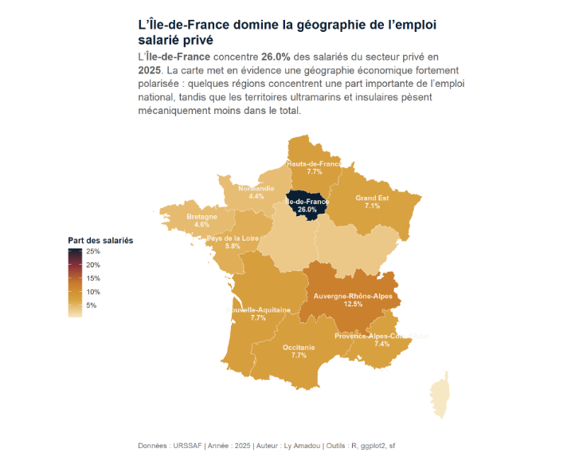
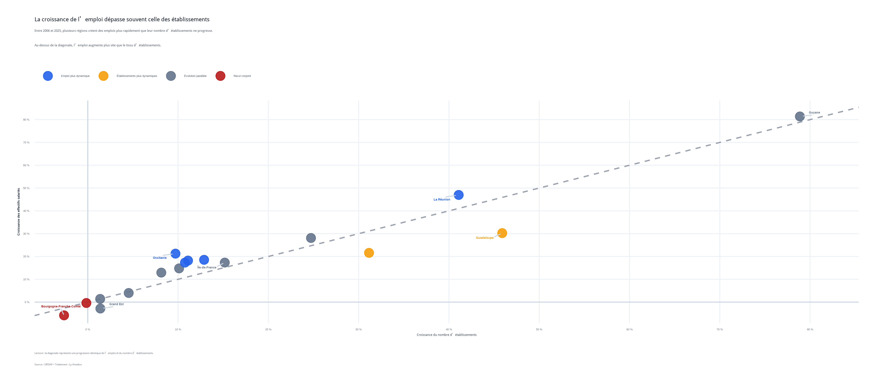
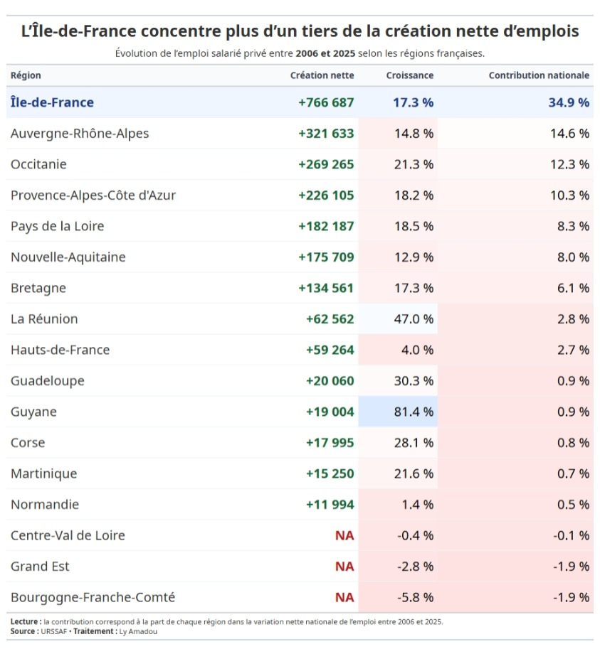
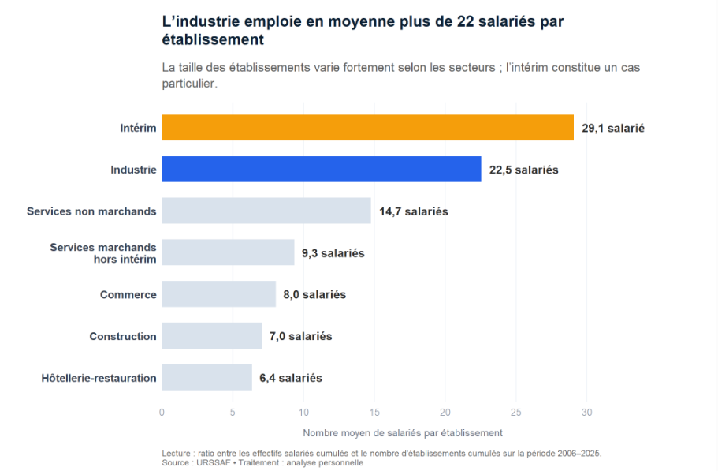

<div align="center">

#  Dynamiques de l'emploi privé en France

### Analyse territoriale et sectorielle • 2006–2025

Analyse de près de 20 années de données URSSAF pour comprendre  
**où se concentre l'emploi privé, quels secteurs le structurent et comment les territoires évoluent.**

<br>


<br>

**Data Analysis · Data Visualization · Geospatial Analysis · Data Storytelling**

<br>

[📄 Rapport complet](reports/rapport-final.pdf)
&nbsp;&nbsp;•&nbsp;&nbsp;
[💻 Code source](scripts/analyse-emploi-prive-france.qmd)
&nbsp;&nbsp;•&nbsp;&nbsp;
[📊 Données URSSAF](LIEN_URSSAF)

</div>

---

##  À propos du projet

Ce projet analyse l'évolution de **l'emploi salarié privé français entre 2006 et 2025**
à partir des données publiques de l'URSSAF.

L'objectif n'est pas uniquement de produire des visualisations, mais de transformer
les données en **indicateurs interprétables** afin d'identifier les principales
dynamiques sectorielles et territoriales de l'emploi.

###  Problématique

> **Comment l'emploi salarié privé français a-t-il évolué depuis 2006, et dans
> quelle mesure cette évolution s'explique-t-elle par la dynamique des
> établissements, les transformations sectorielles et les disparités territoriales ?**

---

#  Executive Summary

| Indicateur | Résultat |
|---|---:|
| Effectifs salariés | **17,78 M → 20,03 M** |
| Croissance de l'emploi | **+12,7 %** |
| Croissance des établissements | **+9,8 %** |
| Contribution de l'Île-de-France | **34,9 %** |
| Croissance régionale relative | **Guyane : +81,4 %** |
| Salariés / établissement industriel | **22,5** |

### 🔎 Ce qu'il faut retenir

**1. L'emploi privé progresse sur le long terme**

Les effectifs salariés passent d'environ **17,78 millions en 2006** à un maximum
d'environ **20,03 millions en 2024**, soit une progression de **12,7 %**.

Le nombre d'établissements progresse également, mais moins rapidement (**+9,8 %**).

>  **La croissance de l'emploi ne repose donc pas uniquement sur l'augmentation
> du nombre d'établissements.**

**2. Le nombre d'établissements n'explique pas à lui seul le poids d'un secteur**

Les **services marchands hors intérim** concentrent environ **36 % des effectifs
salariés** observés sur la période.

L'industrie présente une structure différente : relativement peu d'établissements,
mais une concentration beaucoup plus importante de salariés.

**3. La taille des établissements joue un rôle important**

Le ratio atteint environ **22,5 salariés par établissement dans l'industrie**,
contre seulement **6,4 dans l'hôtellerie-restauration**.

**4. La création d'emplois est géographiquement concentrée**

L'**Île-de-France** représente environ **34,9 % de la création nette nationale**
entre 2006 et 2025.

Avec **Auvergne-Rhône-Alpes** et **l'Occitanie**, ces trois régions représentent
environ **61,8 % de la hausse nette observée**.

---

#  Résultats en images

## Une géographie de l'emploi fortement polarisée

<p align="center">
  
</p>

En 2025, **l'Île-de-France concentre environ 26 % des salariés du secteur privé**,
confirmant son rôle de principal pôle d'emploi français.

---

##  Emploi et établissements : des dynamiques différentes

<p align="center">
  
</p>

La diagonale représente une progression identique de l'emploi et du nombre
d'établissements.

Les régions situées au-dessus connaissent une croissance de l'emploi plus rapide
que celle de leur tissu d'établissements.

---

##  Quelles régions contribuent le plus à la croissance ?

<p align="center">
  
</p>

L'Île-de-France représente à elle seule près de **35 % de la création nette
d'emplois observée entre 2006 et 2025**.

---

## Une structure sectorielle marquée par de fortes différences de taille

<p align="center">
  
</p>

La contribution d’un secteur à l’emploi salarié privé ne dépend pas uniquement du **nombre d’établissements** qui le composent, mais également de leur **taille moyenne**. Certains secteurs reposent ainsi sur un grand nombre de petites structures, tandis que d’autres concentrent les salariés au sein d’établissements de taille plus importante.

Cette distinction permet de mieux comprendre les différences de structure entre secteurs et d’identifier ceux où l’emploi est davantage **fragmenté** ou, au contraire, **concentré**.


 L'analyse complète et les autres visualisations sont disponibles dans le
**[rapport final en pdf](reports/rapport-final.pdf)**
ou en  **[html](reports/analyse_emploi_prive_france.html)**..

---

#  Données

**Source : URSSAF Caisse nationale**  
**Période : 2006–2025**

| Dimension | Variables |
|---|---|
|  Temps | Année |
|  Emploi | Effectifs salariés |
|  Tissu économique | Nombre d'établissements |
|  Activité | Grand secteur d'activité |
|  Taille | Tranche d'effectif |
|  Géographie | Région, département |

> **Note méthodologique :** l'unité d'observation correspond à une agrégation
> statistique par année, département, secteur d'activité et tranche d'effectif.
> Les données ne représentent donc pas des établissements individuels.

---

#  Méthodologie

```text
           DONNÉES URSSAF
                 │
                 ▼
        ┌─────────────────┐
        │ Contrôle qualité│
        └────────┬────────┘
                 ▼
        ┌─────────────────┐
        │ Transformation  │
        │     dplyr       │
        └────────┬────────┘
                 ▼
        ┌─────────────────┐
        │ Agrégation & KPI│
        └────────┬────────┘
                 ▼
     ┌───────────┴───────────┐
     ▼                       ▼
Analyse sectorielle    Analyse territoriale
     │                       │
     └───────────┬───────────┘
                 ▼
        Visualisation
        ggplot2 / sf / gt
                 │
                 ▼
          Data Storytelling
                 │
                 ▼
          Rapport Quarto